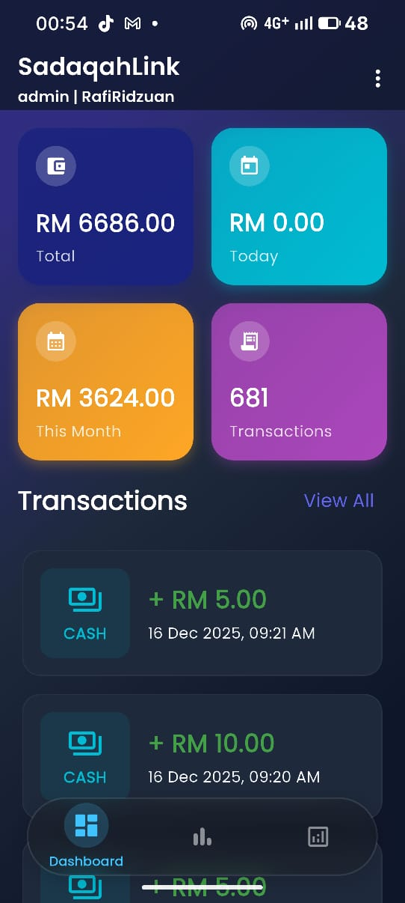
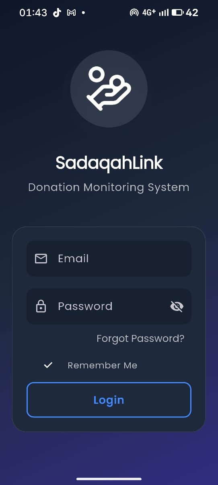
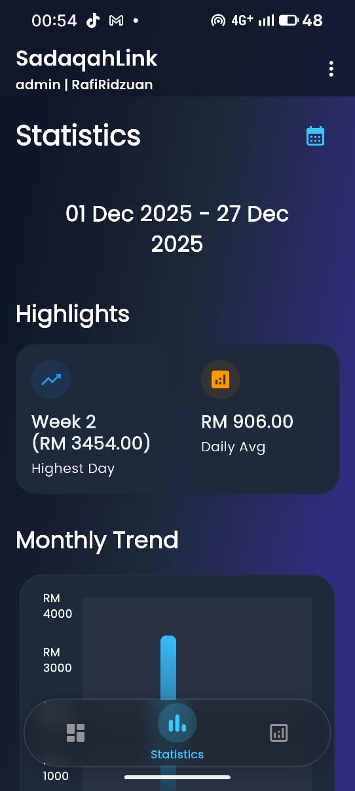
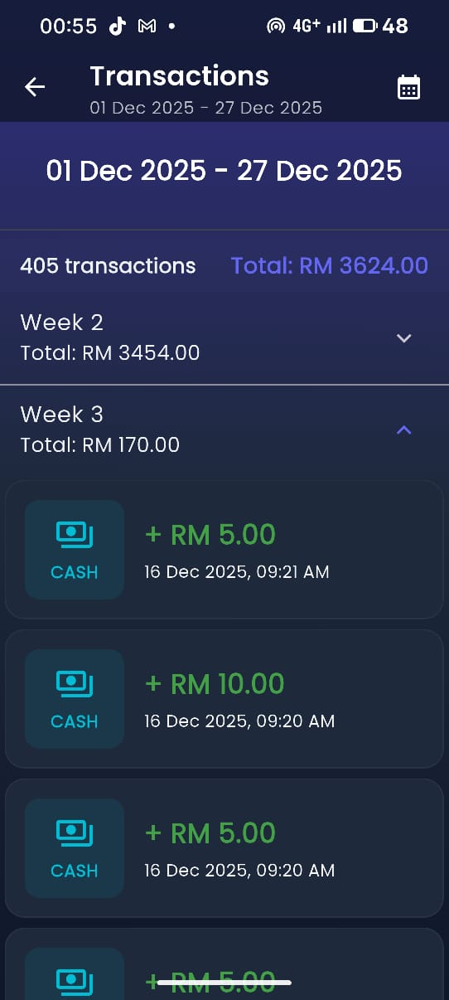
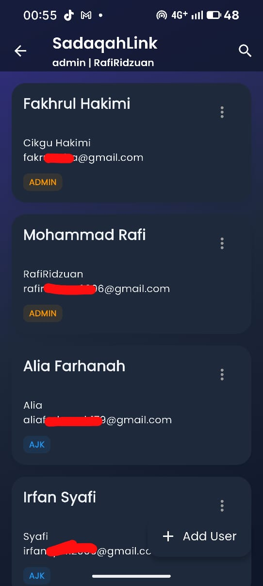
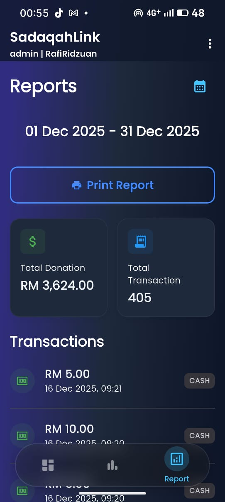
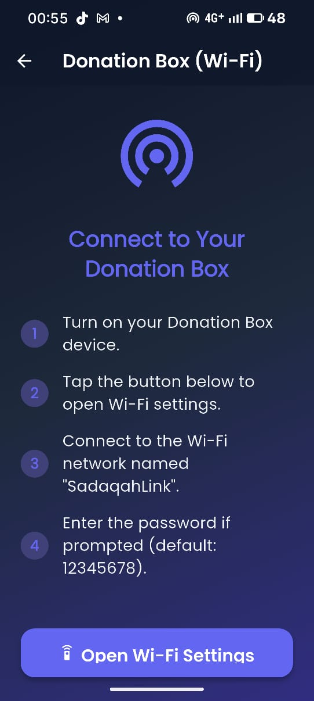
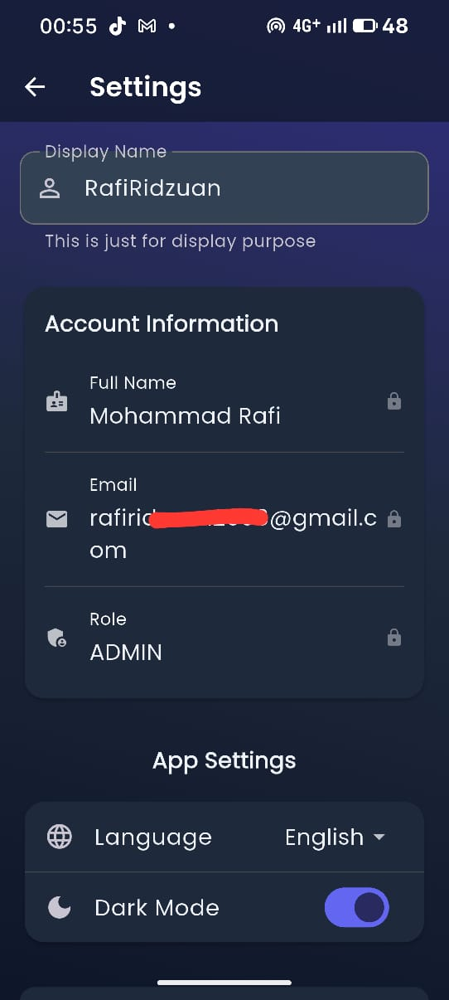

# SadaqahLink - Donation Monitoring Android App

A Flutter-based donation monitoring application connected to Firebase for real-time tracking of donations from ESP32 IoT devices.



## Features

### Authentication & Roles
- **Firebase Authentication** with Email & Password
- **Role-based Access Control**:
  - **Admin**: Full access to view all data and manage users
  - **AJK (Committee Member)**: View-only access to data and statistics

### Dashboard
- Total donations (all time)
- Today's donations
- This month's donations
- Last 5 transactions
- Real-time updates via Firebase Firestore streams

### Transactions
- Complete list of all donation records
- Sorted by timestamp (newest first)
- **Filters**:
  - All
  - Today
  - This Week
  - This Month
  - Custom Date Range
- Shows amount, payment method, and date/time

### Statistics
- **Payment Method Breakdown**: Pie chart showing Cash vs QRPay distribution
- **Donation Trend**: Bar chart showing last 7 days of donations
- **Highlights**:
  - Highest donation day
  - Average daily collection

### Profile
- User information display
- Logout functionality

## 📸 Application Screenshots

| Login & Authentication | Statistics & Analytics |
| :---: | :---: |
|  |  |
| **Transaction History** | **User Management** |
|  |  |
| **Reports** | **Donation Box Setup** |
|  |  |
| **Settings** | **Filter** |
|  |  |

---


## Tech Stack

- **Flutter**: Cross-platform framework (Web, Android, iOS)
- **Firebase**:
  - Firebase Auth: Authentication
  - Cloud Firestore: Real-time database
- **State Management**: Provider
- **Charts**: fl_chart
- **Date Formatting**: intl

## Firebase Setup

### 1. Create Firebase Project
1. Go to [Firebase Console](https://console.firebase.google.com/)
2. Create a new project
3. Enable **Authentication** with Email/Password
4. Enable **Cloud Firestore**

### 2. Configure Firebase for Flutter

#### Install FlutterFire CLI
```bash
dart pub global activate flutterfire_cli
```

#### Configure Firebase
```bash
flutterfire configure
```

This will:
- Create `firebase_options.dart` with your project configuration
- Set up Firebase for all platforms (Web, Android, iOS)

### 3. Firestore Database Structure

#### Collection: `users`
```json
{
  "uid": "string",
  "name": "string",
  "role": "admin | ajk",
  "email": "string"
}
```

#### Collection: `donations`
```json
{
  "id": "auto-id",
  "amount": number,
  "method": "cash | qrpay",
  "timestamp": datetime,
  "source": "esp32"
}
```

### 4. Firestore Security Rules

```javascript
rules_version = '2';
service cloud.firestore {
  match /databases/{database}/documents {
    // Users collection - only authenticated users can read their own data
    match /users/{userId} {
      allow read: if request.auth != null && request.auth.uid == userId;
      allow write: if request.auth != null && get(/databases/$(database)/documents/users/$(request.auth.uid)).data.role == 'admin';
    }
    
    // Donations collection - authenticated users can read, ESP32 can write
    match /donations/{donationId} {
      allow read: if request.auth != null;
      allow create: if true; // ESP32 writes here
      allow update, delete: if request.auth != null && get(/databases/$(database)/documents/users/$(request.auth.uid)).data.role == 'admin';
    }
  }
}
```

### 5. Create Initial Admin User

In Firebase Console > Authentication:
1. Add a user with email/password
2. Copy the UID
3. In Firestore, create a document in `users` collection:
   ```json
   {
     "uid": "<copied-uid>",
     "name": "Admin User",
     "role": "admin",
     "email": "admin@example.com"
   }
   ```

## Installation

### Prerequisites
- Flutter SDK (3.10.0 or higher)
- Dart SDK
- Firebase account

### Steps

1. **Clone the repository**
   ```bash
   cd sadaqahlink
   ```

2. **Install dependencies**
   ```bash
   flutter pub get
   ```

3. **Configure Firebase** (if not done already)
   ```bash
   flutterfire configure
   ```

4. **Run the app**
   
   For Web:
   ```bash
   flutter run -d chrome
   ```
   
   For Android:
   ```bash
   flutter run -d android
   ```
   
   For iOS:
   ```bash
   flutter run -d ios
   ```

## ESP32 Integration

The ESP32 device should send donation data to Firestore using the Firebase REST API or Arduino Firebase library.

### Example ESP32 Code (Arduino Firebase Library)

```cpp
#include <Firebase_ESP_Client.h>

FirebaseData fbdo;
FirebaseAuth auth;
FirebaseConfig config;

void sendDonation(double amount, String method) {
  FirebaseJson json;
  json.set("amount", amount);
  json.set("method", method);
  json.set("timestamp", Firebase.getCurrentTime());
  json.set("source", "esp32");
  
  Firebase.Firestore.createDocument(&fbdo, "<project-id>", "", 
    "donations", "", json.raw());
}
```

## Usage

1. **Login**: Use your email and password
2. **Dashboard**: View summary and recent transactions
3. **Transactions**: Browse all donations with filters
4. **Statistics**: Analyze donation trends and patterns
5. **Profile**: View your info and logout

## Project Structure

```
lib/
├── main.dart                 # App entry point
├── firebase_options.dart     # Firebase configuration
├── models/
│   ├── user_model.dart       # User data model
│   └── donation_model.dart   # Donation data model
├── services/
│   ├── auth_service.dart     # Authentication logic
│   └── firestore_service.dart # Firestore operations
├── screens/
│   ├── login_screen.dart     # Login page
│   ├── home_screen.dart      # Main navigation
│   ├── dashboard_screen.dart # Dashboard tab
│   ├── transactions_screen.dart # Transactions tab
│   ├── statistics_screen.dart # Statistics tab
│   └── profile_screen.dart   # Profile tab
└── widgets/
    ├── summary_card.dart     # Summary card widget
    └── transaction_tile.dart # Transaction list item
```

## License

This project is for internal use only.
